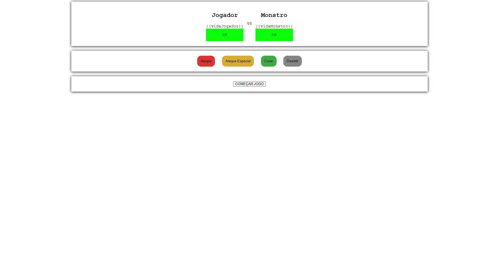

# Matador-de-Monstros

Jogo matador de monstros com Vue.js 2

# Recursos

* O aplicativo foi desenvolvido com JavaScrip, CSS, HTML e Vue 2.

# Uso

1. Clone o repositório do GitHub.
2. Abra o projeto no seu editor de código.
3. Abra o arquivo index no seu browser.

# Créditos

Este projeto foi criado por Alaska Websites.

